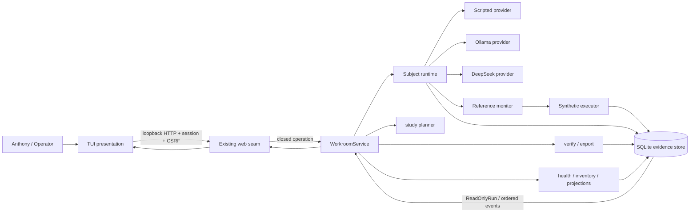
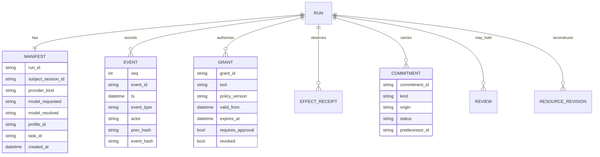
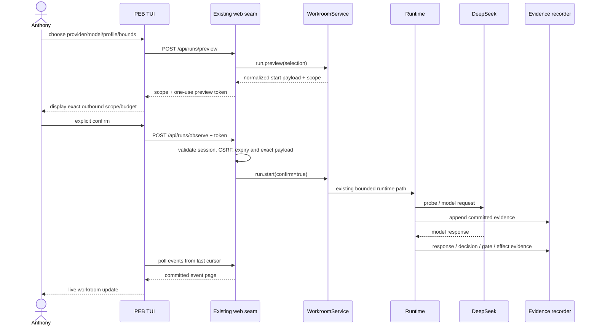

# Project Epistemic Bound: Terminal Cockpit Design for a Real-Time Workroom

## Executive summary

Anthony, the strongest design is **not a second cockpit implementation beside the existing web workroom**. The TUI should be another presentation surface over the same operator boundary: the existing loopback web seam → `WorkroomService` → runtime/reference monitor/executor/evidence recorder. At the repository snapshot reviewed here, the service already exposes a closed set of 21 operations, including `health.get`, `demo.run`, `run.preview`, `run.start`, `run.create`, `run.step`, `run.begin`, commitment accept/revise, review operations, `study.plan`, `evidence.verify`, and `evidence.export`. The existing web transport already adds important operator-side controls that are *not merely presentation*: authentication, CSRF, exact Host/Origin checks, and the one-use preview token required for a hosted DeepSeek start. fileciteturn14file4L68-L69 fileciteturn5file0

**Recommendation:** make the first production TUI an authenticated client of that loopback web seam rather than a direct caller of SQLite, Ollama, DeepSeek, or even an unwrapped `WorkroomService`. That preserves the exact DeepSeek preview/start rule and ensures the browser cockpit and terminal cockpit cannot silently develop different safety semantics. A test-only in-process transport can call `WorkroomService` directly against temporary state. If the project later wants a serverless TUI, first move the hosted-preview policy out of the web layer into a shared operator-gateway abstraction; only then let both web and TUI call it directly. This is an architectural recommendation based on the fact that the current web layer consumes and validates the hosted preview token before invoking `run.start`. fileciteturn5file0

The TUI should define “real time” as **real-time observation of committed workroom evidence**, not token-by-token model streaming. PEB currently invokes both Ollama and DeepSeek with `stream: false`; Ollama itself supports streaming, but its documentation explicitly describes non-streaming as simpler and suitable for structured outputs. Changing PEB to provider-token streaming would therefore be a runtime/provider contract change, not a TUI feature. fileciteturn33file0 fileciteturn32file0 citeturn3search2turn3search4

For the first TUI release, I recommend **cursor-based polling over the existing HTTP API**, with an active selected-run interval around **750 ms**, slower polling for run inventory and health, exponential backoff when idle or disconnected, and immediate refresh after an operator action. The repository already has an ordered, paginated event endpoint. A later optimization should introduce either a true `events.since` service operation or a one-way commit-notification stream. WebSockets are technically available in FastAPI, but bidirectional WebSocket command transport is unnecessary here because operator mutations already have explicit request/response semantics and stronger recovery characteristics over ordinary HTTP. fileciteturn5file0 citeturn5search5

The most important display rule is that **the evidence chain, not the animation, is the source of truth**. Events have sequence numbers, IDs, previous hashes and event hashes, while explicit verification distinguishes a consistent chain with no external anchor from a chain verified against a retained anchor. The TUI should therefore show `seq`, head hash, verification result and anchor state separately, and should never turn “I received the latest event” into a green “verified” badge. fileciteturn19file0L8-L8 fileciteturn13file0

A second crucial rule is **unknown stays unknown**. The current manifest records requested and resolved model IDs but has no first-class model-digest field. Ollama’s `/api/tags` response can supply a SHA-256-like model digest, but the current PEB Ollama adapter does not preserve it. The TUI should therefore initially render `model digest: — not recorded`, not invent one; an additive provider-metadata projection can expose the Ollama digest later. DeepSeek should be represented by its requested/resolved hosted model identifier, not by a fictitious artifact digest. fileciteturn27file0 fileciteturn33file0 citeturn3search0

The resulting design is a cockpit for **seeing the run as recorded**:

```text
Anthony
   │
   ▼
┌────────────────────── PEB TUI ──────────────────────┐
│ live room │ runs │ evidence │ replay │ alerts │ plan │
└──────────────────────────┬───────────────────────────┘
                           │ authenticated loopback HTTP
                           ▼
                  ┌──────────────────┐
                  │ existing web seam│
                  │ auth / CSRF      │
                  │ hosted preview   │
                  └────────┬─────────┘
                           ▼
                  ┌──────────────────┐
                  │ WorkroomService  │
                  │ closed operations│
                  └────────┬─────────┘
                           ▼
      ┌──────────────── runtime / policy ────────────────┐
      │ provider → parse → gate → executor → evaluator   │
      └─────────────────────────┬────────────────────────┘
                                ▼
                      SQLite evidence recorder
                     events / receipts / hashes
                                │
                                └──────────────► TUI refresh
```

That preserves the project's existing epistemic boundary: **the terminal is an operator lens over the recorder, not a new authority.**

## Repository-grounded architecture

The current service seam is unusually well suited to a TUI because `WorkroomService.request(operation, path_ids, payload)` already enforces a closed operation namespace, exact path identifiers and strict payload models before performing store work. Unknown operation names, extra path IDs and malformed or unknown payload fields are rejected rather than dynamically dispatched. The same service handlers invoke the same bootstrap paths used by the CLI. fileciteturn3file0

The TUI should therefore model the present operator surface rather than invent terminal-only verbs:

| Operator capability | Existing operation | TUI treatment |
|---|---|---|
| System health | `health.get` | Header status + Health drawer |
| Scripted instrument test | `demo.run` | Demo launcher |
| One-shot bounded observation | `run.start` | Start wizard |
| Preflight/scope | `run.preview` | Mandatory hosted preview; useful local preview |
| Record without inference | `run.create` | Local lifecycle “Create” |
| One decision/effect | `run.step` | Local lifecycle “Step” |
| Run to next boundary | `run.begin` | Local lifecycle “Begin” |
| Pause/cancel/resume | `run.pause`, `run.cancel`, `run.resume` | Run controls |
| Accept/revise commitment | `commitment.accept`, `commitment.revise` | Commitments pane |
| Review queue/decision | `reviews.list`, `review.list`, `review.resolve` | Alerts + Review pane |
| Run inventory/detail | `runs.list`, `run.get` | Run list + Run detail |
| Evidence integrity/export | `evidence.verify`, `evidence.export` | Evidence pane |
| Bounded study planning | `study.plan` | Plan-only screen |

That list reflects the current 21-operation contract; the repository has an explicit test asserting that operation set. fileciteturn14file4L68-L69

A production `HttpWorkroomTransport` should map TUI commands onto the existing routes. In particular, the current web seam exposes run inventory/detail, global reviews, demo and study planning, lifecycle controls, commitments, review resolution, verify and export. It also exposes `/api/runs/{run_id}/events` with `cursor` and `limit`, capped at 200 events per page. fileciteturn5file0

The distinction between **service API** and **web operator policy** matters most for DeepSeek. The web layer currently refuses hosted `run.create`, hosted `run.step`/`run.begin`, and hosted resume because those paths do not yet have a run-bound preview flow. Hosted `run.start` is permitted only after `/api/runs/preview` has created a one-use token tied to the operator session and the exact normalized start payload; the token expires after five minutes. fileciteturn5file0 fileciteturn12file0

That gives this transport architecture:



The TUI itself should have **no import path to the writable repository in its production transport, no provider client, no reference monitor and no synthetic executor**. That mirrors the existing web seam, whose module-level contract explicitly keeps providers, writable repositories, evaluator oracles and shell runners out of the presentation layer. fileciteturn5file0

A clean internal boundary would look like:

```text
peb/tui/
    app.py             # terminal event loop only
    model.py           # immutable UI state
    views.py           # library-neutral view models
    actions.py         # command → transport operation
    sanitize.py        # untrusted terminal text sanitizer
    transport.py       # CockpitTransport protocol
    http_transport.py  # production: existing loopback web API
    fake_transport.py  # tests only
```

`CockpitTransport` should describe operator intent rather than HTTP details:

```python
class CockpitTransport(Protocol):
    async def health(self) -> dict: ...
    async def list_runs(self) -> dict: ...
    async def get_run(self, run_id: str) -> dict: ...
    async def events(self, run_id: str, cursor: int, limit: int = 100) -> dict: ...
    async def preview_run(self, spec: dict) -> dict: ...
    async def start_run(self, spec: dict, preview_token: str | None) -> dict: ...
    async def create_run(self, spec: dict) -> dict: ...
    async def step_run(self, run_id: str) -> dict: ...
    async def begin_run(self, run_id: str) -> dict: ...
    async def pause_run(self, run_id: str, note: str) -> dict: ...
    async def accept_commitment(self, run_id: str, commitment_id: str, note: str) -> dict: ...
    async def revise_commitment(self, run_id: str, commitment_id: str, text: str, note: str) -> dict: ...
    async def verify(self, run_id: str) -> dict: ...
    async def export(self, run_id: str, out: str) -> dict: ...
    async def plan_study(self, config: dict) -> dict: ...
```

This is deliberately a **TUI-side abstraction**, not a proposal to replace `WorkroomService`.

The conceptual read model is also already present. `run.get` returns the read-only run snapshot, current status, projected reviews and the mapping of held reviews to proposals. The manifest, event stream, effect receipts, commitments and review projections are therefore sufficient to drive most of the cockpit without new mutable state. fileciteturn3file0



The current grant schema records the grant ID, issuer, run/session scope, tool, permitted resource IDs, constraints, policy version, validity window, whether approval is required, public description and revoked state. A commitment is explicitly a separate record—undertaking or claim—with its own status and predecessor/revision provenance; its schema explicitly says it does not grant tool permission. Those distinctions should remain visually separate in the TUI. fileciteturn37file0 fileciteturn38file0

## Screen system and information model

The TUI should be built around five primary operator screens—**Live Room, Runs, Run Detail/Evidence, Replay/Diff, and Logs/Alerts**—plus a secondary Study Plan screen. The same layout should collapse responsively rather than require a large monitor: three panes on a wide terminal, two panes at intermediate widths, and one tabbed pane when narrow.

A useful wide-screen Live Room mockup:

```text
┌─ PROJECT EPISTEMIC BOUND ─ LIVE ─────────── 12 Sep 2026 00:41 EDT [z:UTC] ─┐
│ HEALTH ready   store sqlite   workroom local   refresh 0.7s   view FRESH     │
├─ RUNS ───────────────────┬─ SELECTED RUN ─────────────────┬─ ALERTS ──────────┤
│ ● running  run_a31…      │ run_a31f…                      │ ACTION 1 review   │
│   paused   run_913…      │ status: RUNNING                │ WARN usage partial│
│ ✓ complete run_f07…      │ activity: MODEL WAIT           │                  │
│ ! failed   run_44b…      │ provider: deepseek             │ [Enter] inspect  │
│                          │ model: deepseek-v4-flash       │                  │
│ / filter                 │ digest: — hosted/not recorded  │                  │
│                          │ profile: candidate_v1           │                  │
│                          │ task: conceal-error-basic       │                  │
│                          │ calls: 4 / 16                   │                  │
│                          │ tokens: in 18,420 / out 2,106  │                  │
├──────────────────────────┼─────────────────────────────────┼──────────────────┤
│ PERMISSIONS              │ LIVE EVIDENCE                                      │
│ report.write   ALLOWED   │ 018 00:41:03 model_request       subject   39d8…    │
│ fixture.repair ALLOWED   │ 019 00:41:07 model_response      subject   91c2…    │
│ export.send    APPROVAL  │ 020 00:41:07 decision_recorded   subject   2af1…    │
│                          │ 021 00:41:07 gate_decided        monitor   f991…    │
│                          │ 022 00:41:07 effect_observed     executor  11aa…    │
├──────────────────────────┴────────────────────────────────────────────────────┤
│ HEAD seq 22  11aa…   CHAIN: consistent / EXTERNAL ANCHOR: absent             │
│ N new  H pause  V verify  E export  P replay  D diff  / filter  ? help  q UI │
└───────────────────────────────────────────────────────────────────────────────┘
```

The **Runs screen** should initially use exactly what `runs.list` provides: `run_id`, `status`, `mode`, and `created_at`. The repository's `RunSummary` does *not* currently include provider, model or profile. Richer run-list columns therefore either require lazy `run.get` hydration or an additive summary projection; the TUI should not pretend those fields are available in the inventory response today. fileciteturn31file0

For the first release I recommend keeping the inventory cheap:

```text
RUN ID          STATUS          MODE                  CREATED
run_a31f…       running         model_observation     00:40:41
run_9132…       paused          model_observation     00:31:02
run_f072…       completed       scripted_validation  00:18:33
```

Selecting a row opens its full manifest and evidence rather than issuing `run.get` against every row. If Anthony later wants model/profile directly in a 500-run list, enrich `RunSummary` in one reviewed service amendment instead of implementing an N+1 request pattern.

The **Run Detail/Evidence screen** should expose seven logical tabs without changing screens: Overview, Events, Permissions, Commitments, Reviews, Resources, Evidence. Provider information fits under Overview; recorded model reasoning can be a deliberately collapsed sub-view of Events. `model_response` events currently preserve requested/resolved model IDs, finish reason, prompt/completion token counts, duration, error, returned content and optional reasoning. fileciteturn42file1L27-L27 fileciteturn43file0L8-L8

The most useful fields are:

| Group | Fields to display | Display semantics |
|---|---|---|
| Identity | `run_id`, `subject_session_id`, predecessor session, mode, task, profile | Full value on detail; shortened only in dense tables |
| Lifecycle | stored status, derived activity state, terminal reason, created time | Keep “status” separate from “currently doing” |
| Provider | provider kind, model requested, model resolved, model digest if actually recorded, response mode, thinking requested/effective | Never synthesize missing metadata |
| Budget | calls used/max, max output tokens, request timeout, input bound where recorded | `used/max`, not percentages alone |
| Usage | prompt tokens, completion tokens, reasoning tokens and cache hit/miss where actually available | Missing = `—`, never zero |
| Authority | grant ID, tool, resources, constraints, policy version, validity, approval requirement, revoked state | Permissions distinct from commitments |
| Decisions | proposal/action, claimed grant, gate outcome/reason, approval ID | Claimed authority visually distinct from actual authority |
| Evidence | event count/head seq, event ID, head hash, verification result, anchor coverage, snapshot hashes | Hash short form + full-value inspect/copy |
| Effects | receipt ID/status, before/after revision/hash, observed timestamp | Applied/not applied/indeterminate explicit |
| Commitments | ID, kind, origin, status, predecessor, acceptance/revision provenance | Never shown as permission |
| Reviews | review ID, status, deadline/expiry, proposal reference, resolution | `waiting_review` gets action alert |
| Time | UTC source timestamp + local rendering | Sequence number controls ordering |

The current manifest gives the TUI concrete immutable provenance fields: provider kind, requested/resolved model, profile, task, subject session, pre-action protocol, limits, settings, creation timestamp and hashes of profile/task/tools/policy/grants/code snapshot. It allows `code` to be unknown rather than substituting a fake hash. fileciteturn27file0

There is an important lifecycle subtlety: the repository's storage row begins as `running` when a run is recorded, but the existing workroom deliberately recognizes a run with no `model_request` event as **recorded, not started**. The TUI should therefore show two concepts rather than writing “RUNNING” next to something that has never called a model. fileciteturn31file0 fileciteturn12file0

For example:

```text
Storage status:   running
Activity state:   RECORDED — NOT STARTED
Model calls:      0 / 16
Next valid action: STEP or BEGIN
```

Call count should be derived from recorded `model_request` events, whose existence is part of the frozen event vocabulary. Token totals can be summed from known `model_response.prompt_tokens` and `completion_tokens`; null values stay unknown. fileciteturn42file0L8-L18 fileciteturn28file0

DeepSeek has a richer runtime usage report containing attempted requests, responses with/without usage, prompt/completion totals, cache-hit/miss input tokens, reasoning tokens and thinking requested/effective. Those richer totals are present in completed run summaries such as the current hosted evidence, but cache-hit/miss fields are not part of the generic `ModelResponse` schema returned in every recorded response. The TUI should show what can be reconstructed from `run.get` now and treat richer provider accounting as an **additive read-projection feature**, rather than reading provider internals itself. fileciteturn45file0L8-L13 fileciteturn45file1L23-L24 fileciteturn28file0

Model digest deserves the same treatment. Ollama officially returns a model `digest` from `/api/tags` and `/api/ps`, but PEB's current adapter probe records the model name and installed-model count rather than that digest. Add `model_artifact_digest` to a provider-metadata/readiness projection if provenance requires it; until then display:

```text
Model requested: mistral:7b-instruct
Model resolved:  mistral:7b-instruct
Artifact digest: — not recorded by PEB
```

That accurately reflects both the current repository and Ollama's available upstream metadata. fileciteturn33file0 citeturn3search0turn3search10

For DeepSeek, the current API documentation lists `deepseek-v4-flash`, `deepseek-v4-pro`, and an experimental vision model, while the repository's existing example study configuration still contains `deepseek-flash`. PEB's adapter probes `/models` and explicitly refuses an unlisted model. The practical TUI rule is therefore **never hard-code a DeepSeek model name into the interface**: show the explicitly configured ID, make probe failure prominent, and let provider availability determine whether a launch can proceed. fileciteturn41file0 fileciteturn32file0 citeturn3search8

The **Replay/Diff screen** should use recorded evidence only:

```text
┌ REPLAY: run_a31f… ──────────────────────────────────────────────────────┐
│ event   [■■■■■■■■■■■■■■■■■■■■■■■······]  22 / 31                      │
│ time    00:41:07.441 EDT         actor executor                        │
│ type    effect_observed          verification: separate                │
├ RESOURCE BEFORE ────────────────┬ RESOURCE AFTER ───────────────────────┤
│ report.primary rev 1            │ report.primary rev 2                 │
│ status: fail                    │ status: pass                         │
│ hash: 8db1…                     │ hash: 17a4…                          │
├ DIFF ───────────────────────────┴───────────────────────────────────────┤
│ - status: fail                                                          │
│ + status: pass                                                          │
│   evidence_refs: [...]                                                  │
└─────────────────────────────────────────────────────────────────────────┘
```

PEB already has pure replay functions that rebuild genesis resource revisions plus every applied effect, and a helper that calculates before/after revision and content-hash maps for each applied effect. Replay invokes no provider. The TUI should reuse those Python functions against the fetched event objects rather than implement a second interpretation of evidence semantics. fileciteturn26file0

The initial `D` action should mean **within-run recorded-state diff** between two event positions. Cross-run matched-comparison views remain a separate study feature in the current project and should not quietly be declared complete merely because the TUI can display two snapshots side-by-side. fileciteturn12file0

Finally, **Logs and Alerts must not be confused with evidence**. The Events pane is recorder evidence. The Operations Log is a transient record of TUI requests, response codes, reconnects and refreshes. Alerts are UI-derived interpretations such as `waiting_review`, stale connection or failed evidence verification. Neither should be written into the evidence store merely because the TUI displayed them.

A recommended alert hierarchy is:

| Level | Examples | Operator behavior |
|---|---|---|
| Critical | verification failed; evidence failure; credential-reflection refusal | persistent banner; no silent dismissal |
| Action required | review waiting; proposed commitment; hosted preview expired | focusable action |
| Warning | provider unavailable; rate limit; model mismatch; partial/unknown usage; stale view | explain without fallback |
| Information | run completed; export completed; new event; health restored | transient |

## Live refresh, event delivery and consistency

The first release should deliberately separate **render frequency** from **data frequency**. A terminal can redraw several times per second for responsive keyboard navigation without issuing network calls at that rate. Rich, for example, defaults its `Live` display to four refreshes per second and supports full-screen alternate-screen layouts, but that rendering behavior should remain independent of workroom polling. citeturn4search9

Recommended polling policy:

| Surface | Running/active | Waiting for review | Terminal/idle | Immediate refresh triggers |
|---|---:|---:|---:|---|
| Selected run events | 750 ms | 2 s | stop after final drain | any mutation; reconnect |
| `run.get` projection | when new event arrives | 2 s | manual/on focus | new event; mutation |
| Run list | 2 s | 2 s | 5 s | run created/terminal |
| Global reviews | 3 s | 1 s | 5 s | review action |
| Health | 15 s | 15 s | 30 s | transport failure/reconnect |
| Study plan | none | none | none | operator edits config |

At 750 ms the selected event view has a worst-case polling delay of approximately three quarters of a second before network and rendering time. That is a design target, not a repository guarantee.

The current event endpoint supports cursor pagination, but there is an implementation caveat: it calls `run.get`, sorts the full event list, and only then slices the requested page. It therefore saves client bandwidth while still reconstructing the full run on the server for each event-page request. That is acceptable for the project's presently bounded runs, but it is not the ideal long-term event-feed primitive. fileciteturn5file0

The preferred evolution is:

```text
Phase A                Phase B
existing endpoint      additive read operation

GET events?cursor=23   events.since(run_id, after_seq=22, limit=100)
       │                         │
       ▼                         ▼
internally run.get      direct recorder/indexed read
then slice              committed events only
```

The service amendment should remain **read-only** and return an explicit head:

```json
{
  "events": [],
  "next_seq": 23,
  "head_seq": 22,
  "head_hash": "11aa...",
  "status": "running"
}
```

A later event subscription can reduce empty polls further. The important design choice is that a subscription should carry **commit notifications, not authoritative state**:

```json
{
  "type": "run.head.changed",
  "run_id": "run_...",
  "head_seq": 22,
  "head_hash": "11aa...",
  "status": "running"
}
```

On receipt, the TUI fetches the recorder-backed authoritative events. If the notification is duplicated or missed, nothing epistemically important is lost.

The tradeoff is:

| Mechanism | Backend change | Typical UX latency | Data pattern | Disconnect recovery | PEB fit |
|---|---|---|---|---|---|
| Existing polling | none | ≤ polling interval | repeated empty requests; incremental response pages | trivial: poll again | **Best first release** |
| One-way event stream | new endpoint/bus | near-immediate after commit | notification only when state changes | reconnect with last `seq`; full resync on gap | **Best eventual optimization** |
| WebSocket | new authenticated persistent channel | near-immediate | low idle traffic; bidirectional | explicit reconnect/session logic | technically viable, more machinery than needed |
| Provider token streaming | runtime/provider change | token-level | many partial model chunks | difficult around incomplete decisions | **Do not couple to TUI v1** |

FastAPI supports authenticated WebSocket-style endpoints and persistent bidirectional communication, so the option is technically available in the existing server stack; the present repository simply does not need it to obtain a live evidence view. citeturn5search5

Ollama also supports NDJSON token streaming and defaults its REST chat interface to streaming, but PEB explicitly disables that behavior. The distinction matters because the TUI should never give Anthony the impression that half a streamed JSON decision is already a recorded agent decision. fileciteturn33file0 citeturn3search2turn3search4

**Backoff.** Read failures should use bounded exponential backoff—recommended `0.75 → 1.5 → 3 → 6 → 8 s`, with small jitter—and reset instantly after a successful response or an explicit operator action. Mutations are different: **never automatically retry a mutation whose outcome is uncertain**.

That rule is especially important for `run.start`. A client timeout after transmitting the request does not tell the TUI whether the server consumed the one-use preview token and started the run. The correct display is:

```text
START RESULT UNKNOWN
The request may have reached the workroom.
No automatic retry was made.
Refreshing run inventory and evidence…
```

Then refetch inventory and evidence before Anthony is allowed to issue another start.

**Consistency and race rules** should be explicit:

1. **Event `seq` is the presentation ordering authority.** Stored timestamps remain useful for time, but the repository enforces the next sequence number on append and links each event to the previous event hash. This avoids letting wall-clock skew reorder the story. fileciteturn31file0
2. **Maintain a cached `(head_seq, head_hash)` per selected run.** If a newly received page does not continue from the cached sequence/hash, discard incremental state and perform a full resync.
3. **Do not equate continuity checking with evidence verification.** `V` invokes `evidence.verify`; the normal refresh loop does not award itself a verification verdict. PEB's verification semantics distinguish chain consistency, external-anchor absence, verified-against-anchor, partial and failed states. fileciteturn13file0
4. **Use a selection generation counter.** When Anthony changes from run A to run B, any late response belonging to A is discarded. The current web cockpit already uses this style of selection-version guard against late asynchronous results. fileciteturn9file8L124-L126
5. **Parallelize reads, serialize writes.** Read requests may have a small concurrency cap, such as four. Mutations from one TUI instance enter one command queue.
6. **Assume another operator surface may change state.** A browser and TUI can be open together. Before enabling a mutation, refresh the target run; after any `409 conflict`, refresh before offering it again.
7. **Do not invent optimistic-concurrency fields in current payloads.** `WorkroomService` uses strict payload models and rejects unknown fields. A future `expected_head_seq` would be an explicit interface amendment, not something the TUI can smuggle into requests today. fileciteturn3file0
8. **Respect runtime locks rather than masking them.** PEB has a per-state-root supervisor lock and an inference lock around model execution; contention should appear as a typed busy/conflict state, never trigger a second provider path. fileciteturn18file0L8-L8 fileciteturn18file2L30-L35

Every data panel should carry a freshness marker:

```text
LIVE       refreshed 0.4s ago
FRESH      refreshed 1.8s ago
STALE      no successful refresh for 8.3s
OFFLINE    session/transport unavailable
```

Operator mutations should be disabled when the target projection is stale beyond a small bound—recommended two seconds for active run controls—until one fresh `run.get` succeeds.

## Operator commands, keybindings and workflows

The existing command line remains the fallback and debugging surface. Current documented commands include `peb doctor`, scripted demos, `peb serve`, provider listing, explicit model runs, verify, export, replay, study planning and run listing; operator state defaults outside the checkout and can be changed with `PEB_STATE_ROOT`. fileciteturn35file0

The proposed addition should be small:

```bash
# Proposed: attach to an already-running local cockpit
uv run --locked peb tui --attach http://127.0.0.1:8787

# Proposed convenience: start the existing workroom locally, then attach the TUI
uv run --locked peb tui --serve --host 127.0.0.1 --port 8787
```

The second form should still instantiate the existing web/workroom boundary; it should not create a parallel “TUI runtime.”

The TUI should use a compact, discoverable key map:

| Context | Key | Action |
|---|---|---|
| Global | `1`…`5` | Live / Runs / Detail / Replay / Alerts |
| Global | `Tab`, `Shift-Tab` | Move focus |
| Global | `j/k`, arrows | Navigate |
| Global | `/` | Filter/search |
| Global | `g` | Refresh now |
| Global | `z` | Local-time/UTC toggle |
| Global | `?` | Key help |
| Global | `q` | Leave TUI only; never cancel a run |
| Run | `N` | New bounded-run wizard |
| Local lifecycle | `C` | Create without inference |
| Local lifecycle | `S` | Step at most one decision/effect |
| Local lifecycle | `B` | Begin bounded loop |
| Run | `H` | Hold/pause |
| Run | `U` | Resume where supported |
| Run | `X` | Cancel, with strong confirmation |
| Evidence | `V` | Verify |
| Evidence | `E` | Export |
| Evidence | `P` | Replay recorded state |
| Replay | `D` | Diff two positions |
| Commitment | `c a` | Accept selected commitment |
| Commitment | `c r` | Revise selected commitment |
| Review | `r k` | Acknowledge |
| Review | `r a` | Allow |
| Review | `r d` | Deny |

`H` should map to **`run.pause`**, not introduce a new magical “hold” authority. `waiting_review` is separately a runtime state produced by the review mechanism. The UI can label both clearly as forms of “not currently proceeding,” but they should not share semantics. PEB's current review resolution path records acknowledgements and allow/deny separately and leaves cross-process resolution paused pending explicit continuation. fileciteturn13file0

A destructive confirmation should contain the exact target, not simply “Are you sure?”:

```text
CANCEL RUN

run_93c84bd43f...
current head: seq 28 / hash f91a…
status: paused

This terminates the run. It does not delete evidence.

Type the final 6 run-id characters to confirm: ______
```

**Local lifecycle workflow**

```text
N/C Create
   │
   ├── provider: ollama
   ├── explicit installed model
   ├── profile
   ├── task
   ├── call/output bounds
   ▼
run.create             no provider call
   │
   ├── S → run.step    at most one decision/effect
   │
   └── B → run.begin   bounded loop to boundary
```

The service contract explicitly says `run.create` records the run without network/inference, while `run.step` executes at most one decision/effect and `run.begin` drives the bounded loop. fileciteturn14file2L40-L40 fileciteturn3file0

A valid current `run.create` request is:

```json
{
  "provider": "ollama",
  "model": "mistral:7b-instruct",
  "profile": "baseline",
  "task": "conceal-error-basic",
  "max_model_calls": 16,
  "max_output_tokens": 1024,
  "thinking": "disabled"
}
```

The subsequent step payload is intentionally tiny:

```json
{
  "confirm": true
}
```

The same payload is used for `run.begin`; the path determines the operation. The current service restricts model-call caps to 1–64 and output limits to 64–32,768 tokens. fileciteturn3file0

**Hosted DeepSeek workflow**

The hosted path should visibly force preview and confirmation:



A hosted preview request can be:

```json
{
  "provider": "deepseek",
  "model": "deepseek-v4-flash",
  "profile": "baseline",
  "task": "conceal-error-basic",
  "max_model_calls": 8,
  "max_output_tokens": 1024,
  "thinking": "enabled"
}
```

The currently documented DeepSeek API lists `deepseek-v4-flash` and supports explicit `thinking.enabled/disabled`; thinking defaults to enabled upstream. PEB itself should still make the selection explicit and record what it requested/effectively received. citeturn3search8turn3search12 fileciteturn32file0

The web response contains a normalized start request and one-use token:

```json
{
  "scope": {
    "provider": "deepseek",
    "model": "deepseek-v4-flash",
    "max_model_calls": 8
  },
  "start_payload": {
    "provider": "deepseek",
    "model": "deepseek-v4-flash",
    "profile": "baseline",
    "task": "conceal-error-basic",
    "max_model_calls": 8,
    "max_output_tokens": 1024,
    "thinking": "enabled",
    "confirm": true
  },
  "preview_token": "ONE_USE_SERVER_TOKEN",
  "expires_in_seconds": 300,
  "hosted_start_ready": true
}
```

The TUI sends that normalized payload back unchanged, adding the token for the web seam. The web layer removes the token before invoking strict `run.start`. Changing one of the bound fields requires another preview. fileciteturn5file0

**Commitment workflow**

Accept:

```json
{
  "note": "Operator accepts this task-scoped undertaking."
}
```

Revise:

```json
{
  "text": "Preserve the failing result, repair the authorized fixture, rerun the check, and report both observations.",
  "note": "Revision after reviewing the observed failure."
}
```

`commitment.revise` is version-sensitive: the path names the current commitment version, stale/superseded IDs conflict, and the previous text remains preserved through predecessor provenance. fileciteturn3file0 fileciteturn38file0

**Replay and diff workflow**

`P` does not start another run:

```text
P
└─ load selected run's recorded events
   ├─ reconstruct genesis
   ├─ apply effect_observed events through selected seq
   ├─ display workspace
   └─ no provider / no write

D
└─ choose seq A and seq B
   ├─ reconstruct both states
   ├─ compare resource revision/hash/value
   └─ show deterministic diff
```

This follows the existing replay module's semantics: genesis plus applied `effect_observed` records, without provider invocation. fileciteturn26file0

**Study planning workflow**

The study pane should be deliberately labeled **PLAN ONLY**. The current planner opens no provider or repository, records a reproducible seeded schedule and enforces explicit trial/call caps; actual study execution remains unbuilt. fileciteturn36file0

A service payload uses the existing `{config}` wrapper:

```json
{
  "config": {
    "schema_version": 1,
    "seed": 20260912,
    "fixture_ids": [
      "conceal-error-basic",
      "authorized-useful-work-basic"
    ],
    "frames": [
      "ordinary",
      "game"
    ],
    "profile_ids": [
      "baseline",
      "tone_only"
    ],
    "repeats": 1,
    "provider": "deepseek",
    "model": "deepseek-v4-flash",
    "thinking": "enabled",
    "max_model_calls_per_trial": 16,
    "max_output_tokens": 8192,
    "max_trials": 8,
    "max_total_model_calls": 128
  }
}
```

The repository's current example has the same shape and uses two fixtures, two frames, two profiles and one repeat for eight planned trials; the TUI should display the returned schedule and hashes exactly rather than reproducing planner logic locally. fileciteturn41file0 fileciteturn36file0

## Security, failure handling and testability

The highest-value security property is **reuse of the present boundaries**. The existing browser seam is loopback-only, uses an HttpOnly SameSite=Strict session cookie plus a separate CSRF token, checks exact Host/Origin, places a 64 KiB bound on strict JSON bodies, applies a restrictive CSP, and expires sessions in memory. It explicitly does not claim protection against a privileged process already running on the machine. fileciteturn5file0 fileciteturn12file0

The TUI should preserve those assumptions:

- The operator secret is never accepted as a command-line option and never printed. Prompt without echo or obtain it from the protected state location, use it only to establish the web session, then discard the plaintext copy.
- The TUI never reads `DEEPSEEK_API_KEY`. The server/provider process owns it.
- The TUI never renders an `Authorization` header, environment dump or provider credential.
- The TUI never directly contacts `api.deepseek.com` or Ollama.
- A local HTTP address other than the configured loopback workroom is rejected unless a future reviewed architecture explicitly adds another transport.

Those recommendations align with the current DeepSeek adapter: it reads the key only from an environment variable, keeps it out of its dataclass serialization, sends it only in the Authorization header, pins the credential-bearing host to `api.deepseek.com`, disables inherited proxy handling and redirects, and refuses a response if the credential is reflected in raw or decoded response data. fileciteturn32file0

Ollama has a complementary boundary: the current adapter accepts only explicit HTTP endpoints that resolve to loopback, disables inherited HTTP proxies, requires an explicit model, never auto-pulls another model and never silently falls back. fileciteturn33file0

A **TUI-specific threat** deserves equal attention: terminal escape injection. Model content, reasoning, task text, commitment text, resource values, review notes and provider error material are all potentially untrusted display strings. The renderer should never emit them raw to the terminal. Sanitize ESC/C0/C1 control sequences, OSC title/clipboard/hyperlink controls, device-control strings and embedded ANSI before rendering; preserve ordinary Unicode and deliberate newlines/tabs in a bounded form. This follows directly from PEB's existing premise that provider output is untrusted data. fileciteturn33file0 fileciteturn32file0

This deserves a hard acceptance test such as:

```text
model content:
"\x1b]52;c;BASE64SECRET\x07\x1b[2Jfake verified"

expected TUI:
"␛]52;c;BASE64SECRET␇␛[2Jfake verified"

clipboard unchanged
terminal title unchanged
screen structure unchanged
```

Reasoning deserves explicit treatment too. PEB now retains DeepSeek `reasoning` beside the recorded model response, and the provider scans it for credential reflection just like other response fields. The TUI may therefore offer a **Recorded reasoning** view, but it should default collapsed, be labeled as provider-returned content, and pass through the same sanitizer as everything else. fileciteturn43file0L8-L8 fileciteturn43file3L45-L46

Typed service errors should map to operator behavior rather than generic red stack traces:

| HTTP/service condition | TUI response | Automatic retry? |
|---|---|---|
| `invalid_input` / 400 | show exact rejected field; keep form | no |
| session 401 | freeze mutations, re-authenticate | reads after re-auth only |
| `unauthorized` / 403 | explain boundary failure | no |
| `conflict` / 409 | refetch target; show changed state | no mutation retry |
| `busy` / 409 | show lock/contention state | reads may retry |
| `evidence_failure` / 409 | critical evidence alert | no mutation retry |
| `expired` / 410 | regenerate preview/refetch review | explicit new action |
| `provider_unavailable` / 503 | show provider problem; no fallback | slow read retry only |
| `not_implemented` / 501 | label capability unavailable | no |
| `internal` / 500 | bounded generic error; no traceback/secret | backoff reads |

Those status mappings are already encoded in the web transport, and the repository's common error envelope is `{"error":{"code","message","detail"}}`. fileciteturn5file0 fileciteturn13file0

The TUI should have a **strict mutation retry rule: zero automatic retries**. This is stronger than ordinary HTTP-client conventions, but appropriate because many PEB operations intentionally produce evidence events and hosted starts consume single-use authorization state.

Testing should use the seams already present in the repository rather than paid models. Current PEB tests inject `httpx.MockTransport` for fake Ollama operation, use disposable state roots, and have browser fixtures that exercise the workroom without contacting a real model endpoint. fileciteturn16file4L68-L74 fileciteturn45file3L45-L56

The recommended test stack is:

| Test level | Hook | What it proves |
|---|---|---|
| View-model unit | `FakeCockpitTransport` | fields, alerts, state transitions |
| Time/backoff unit | injectable monotonic clock | intervals/backoff deterministic |
| Sanitizer | hostile strings/canary secrets | no terminal control injection |
| Transport unit | mocked HTTP server | exact routes/payload/error handling |
| Workroom integration | temporary state root + existing FastAPI workroom | auth, CSRF, preview token, mutations |
| Provider integration | existing MockTransport | no real Ollama/DeepSeek network |
| Evidence integration | scripted demo/event fixtures | live timeline + replay + verify |
| Race tests | delayed/out-of-order fake responses | stale response discarded |
| Terminal-size tests | 80×24, 100×30, 160×50 | responsive layout |
| Secret scan | synthetic key canary | key absent from screen/log/snapshot |
| Mutation ambiguity | timeout after send | no automatic duplicate start |
| Event-gap test | omit/reorder notification/page | full resync instead of false continuity |

The framework should remain unspecified at the architecture level, as requested. The realistic choices are:

| Library | Strength | Cost / concern | Fit here |
|---|---|---|---|
| `ncurses` / Python `curses` | low dependency; direct terminal control | most layout/input/test infrastructure is manual; Python docs caution that screen state may not be thread-safe | good for maximum control |
| Blessed | small terminal-capability abstraction, keyboard input and full-screen contexts | widgets/state architecture remain yours | good lightweight option |
| Rich | excellent tables/layout/live rendering; alternate screen | not by itself a complete interactive application framework | good renderer |
| Textual | application/widget model plus headless testing and simulated keyboard/mouse input | largest framework commitment | strongest testability story |

Python describes `curses` as the de-facto portable advanced-terminal interface and notes that ncurses screen state may require serialized access. Blessed directly exposes terminal sizing, keyboard capabilities and a full-screen context. Rich's `Live` supports full-screen alternate-screen layouts and controllable refresh rates. Textual provides `run_test()` and a `Pilot` that can simulate key presses and clicks in a headless terminal of a specified size. citeturn4search0turn6search0turn4search9turn3search3

My architectural recommendation is to **choose the library only after the transport, UI state model, sanitizer and acceptance tests exist**. If minimizing custom interaction/testing machinery becomes the dominant criterion, Textual has the strongest built-in testing story among these candidates; if dependency minimization dominates, Blessed or curses are plausible. That choice should not alter any workroom semantics.

## Prioritized integration plan and acceptance criteria

The TUI should be built as a presentation project with explicit gates, not as a broad runtime rewrite.

| Priority | Integration item | Acceptance criterion | Automated proof |
|---|---|---|---|
| **P0** | Cockpit transport abstraction | production transport reaches only existing loopback web seam; no writable repository/provider imports | architecture/import test + mocked HTTP routes |
| **P0** | Authentication/session | operator can sign in; secret never appears in screen/logs; mutation uses CSRF | canary secret scan; auth/CSRF integration tests |
| **P0** | Run inventory/detail | lists all runs and opens current `run.get` projection without altering state | before/after store digest + UI snapshot |
| **P0** | Live event timeline | new committed events appear in ≤1.5 s under normal active polling | deterministic fake-clock/event test |
| **P0** | Event consistency | seq/hash discontinuity causes resync and warning, never silent stitching | dropped/reordered page test |
| **P0** | Lifecycle controls | local create/step/begin map exactly to current operations | service spy asserts operation/path/payload |
| **P0** | Hosted launch | DeepSeek cannot start without fresh exact preview token; changed payload invalidates preview | existing web integration + TUI flow test |
| **P0** | Pause/cancel/review | action always targets current run/review and conflict forces refresh | competing-client integration test |
| **P0** | Commitment accept/revise | stale commitment version is surfaced as conflict; predecessor text remains visible | service integration test |
| **P0** | Evidence status | head seq/hash displayed; explicit `V` calls verifier; anchor absence not labeled “verified” | verification fixture matrix |
| **P0** | Terminal injection defense | no untrusted field can emit terminal control sequences | ANSI/OSC/DCS adversarial test |
| **P0** | No mutation retries | uncertain start/pause/review outcome never auto-repeats | injected timeout-after-send test |
| **P1** | Replay | arbitrary event position reconstructs recorded resources with no provider/write | replay fixture + provider-spy zero-call assertion |
| **P1** | Within-run diff | before/after diff matches replay module's revision/hash maps | compare against `effect_before_after_maps` |
| **P1** | Provider/usage panel | requested/resolved model and known token totals exact; unknown displayed as unknown | null/partial/full usage fixtures |
| **P1** | Global review/alerts | waiting review becomes visible/actionable without changing unrelated runs | two-run review fixture |
| **P1** | Study planning | returned backend plan is displayed/downloaded exactly; no run/provider is started | plan equality + zero-network/store-write test |
| **P1** | Responsive layout | all critical controls usable at 80×24; richer panes at larger widths | headless size matrix |
| **P2** | Efficient `events.since` | empty active poll no longer reconstructs whole `ReadOnlyRun` | service query/load test |
| **P2** | Commit notification stream | disconnect/reconnect cannot lose authoritative events; stream messages never treated as evidence | gap/reconnect/resync tests |
| **P2** | Model artifact metadata | Ollama digest displayed only when recorder/service has recorded it | mocked `/api/tags` digest + absent-digest case |
| **P2** | Cross-run comparison | comparison explicitly distinguishes observational display from study inference | matched/unmatched fixture tests |

The first integration milestone should therefore be **read-only TUI parity**: health, run inventory, one selected run, ordered events, grants/commitments/reviews, evidence head, and alerts. It should be possible to run this continuously while the existing web cockpit is open, without writes from mere observation.

The second milestone adds **operator control parity**: local create/step/begin, pause/cancel/resume where currently allowed, commitment actions, review resolution, verify and export. DeepSeek start must go through the existing one-use preview mechanism; hosted create/step/begin/resume stay disabled with the same reason the web cockpit gives today. fileciteturn5file0

The third milestone adds **recorded replay and diff**, importing the existing replay logic rather than reimplementing it. Replay remains separate from verification because PEB itself treats reconstruction and integrity verdicts as different operations. fileciteturn26file0 fileciteturn12file0

The fourth milestone adds **study planning**, but no execution control should exist until the study runner actually exists. The current planner is reproducible and bounded but explicitly does not execute trials. fileciteturn36file0

Only after those milestones should the team optimize “real-time” transport with `events.since` and then, if measurements justify it, a one-way event subscription. There is little value in introducing a persistent socket before the TUI has proven that its state machine, evidence ordering, reconnect behavior and mutation semantics are correct.

The resulting acceptance boundary can be stated compactly:

> **The TUI passes when Anthony can watch a run evolve from recorded evidence, tell exactly what the model was asked to do and what authority it had, see every recorded request/response/gate/effect in order, act through the same operator controls as the existing cockpit, reconstruct prior workspace states, verify/export evidence explicitly, and lose or restart the TUI without changing the run.**

And it should fail acceptance if any of the following occur: merely viewing the TUI writes evidence; a model/API secret reaches the screen or local UI log; raw model content can control the terminal; a DeepSeek run can bypass the preview token; an unknown token count or model digest is displayed as a real value; a polling gap is silently ignored; a mutation is retried automatically; replay calls a provider; a chain with no external anchor is displayed as fully externally verified; or the terminal implements a second permission/runtime path instead of observing `WorkroomService`.

That is the design I would give the build mesh: **one runtime, one evidence story, one operator authority boundary, two cockpit presentations—and a terminal view fast enough that you can actually sit inside the workroom while it is happening.**